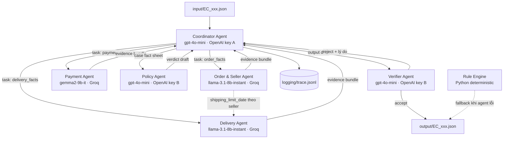

# Kiến trúc Multi-Agent — EC Dispute Resolution (EC_POLICY_V1)

## 1. Nguyên tắc thiết kế

Bốn nguyên tắc chi phối toàn bộ kiến trúc bên dưới:

1. **LLM phán đoán, Python tính toán.** Không một con số tiền nào do LLM tự cộng. Mọi phép cộng `price`, `freight_value`, `payment_value` chạy trong tool Python và trả về cho agent dưới dạng fact đã tính sẵn. LLM chỉ chọn nhánh nghiệp vụ và diễn giải.
2. **Không agent nào nhìn thấy toàn bộ dữ liệu.** Mỗi agent có một scope truy cập riêng (mục 4). Agent muốn dữ liệu ngoài scope thì phải hỏi qua Coordinator — đây chính là handoff mà đề bài yêu cầu.
3. **Bằng chứng phải dựng được từ dữ liệu.** Evidence ID không do LLM sinh tự do; agent đề xuất, Verifier đối chiếu với index đã load từ CSV, ID nào không khớp thì bị loại trước khi ghi file.
4. **Không bao giờ để thiếu file output.** Nếu chuỗi agent lỗi (JSON hỏng, rate limit, timeout), rule engine deterministic chạy bù để vẫn ghi ra một output hợp lệ schema. Thiếu 1 trong 50 file là mất trắng điểm case đó.

## 2. Sơ đồ agent



Ba agent domain (Order & Seller, Payment, Delivery) chạy **song song** vì không phụ thuộc nhau. Chỉ có một luồng phụ thuộc: Delivery cần `shipping_limit_date` của từng seller do Order & Seller trích ra, nên Order & Seller hoàn thành trước khi Delivery kết luận trách nhiệm giao trễ.

## 3. Vai trò từng agent

### 3.1 Coordinator Agent

Nhận `EC_xxx.json`, đọc `claimed_order_id` và phát 3 task song song cho 3 agent domain. Không tự đọc CSV — nếu Coordinator được đọc dữ liệu thì cả kiến trúc sụp thành một agent duy nhất.

Sau khi nhận đủ 3 evidence bundle, Coordinator gộp thành **case fact sheet** (một JSON phẳng chứa toàn bộ fact đã kiểm chứng), chuyển cho Policy Agent, rồi nhận verdict và ráp thành output draft. Nếu Verifier từ chối, Coordinator nhận lý do và tái phát task cho đúng agent gây lỗi, tối đa 2 vòng.

Coordinator cũng là nơi duy nhất ghi `trace.jsonl`, để thứ tự dòng trace phản ánh đúng thứ tự handoff.

### 3.2 Order & Seller Agent

Trả lời: đơn này ở trạng thái gì, gồm những dòng hàng nào, seller nào bán, hạn bàn giao của từng seller là bao giờ.

Output bundle:

```json
{
  "order_id": "...",
  "order_status": "delivered",
  "has_items": true,
  "items": [{ "order_item_id": 1, "seller_id": "...", "shipping_limit_date": "...", "price": 58.90, "freight_value": 13.29 }],
  "item_total_brl": 58.90,
  "freight_total_brl": 13.29,
  "seller_ids": ["..."],
  "evidence": ["order:...", "item:...:1", "seller:..."]
}
```

Xử lý biên: order không có dòng hàng nào thì `has_items = false`, `item_total_brl` và `freight_total_brl` bằng `0.0`, `item_ids` và `seller_ids` để rỗng.

### 3.3 Payment Agent

Trả lời: khách đã trả bao nhiêu, trả mấy lần, tổng tiền có khớp với tiền hàng cộng phí ship không.

Đối soát: `payment_total` so với `item_total + freight_total`, ngưỡng lệch cho phép **0.10 BRL**. Cờ `is_split_payment` bật khi có từ 2 payment row. Cờ `reconciled` bật khi lệch nằm trong ngưỡng.

Lưu ý chống bẫy dữ liệu: `payment_value` là số tiền của từng dòng thanh toán, **không phải** tiền mỗi kỳ trả góp. Không nhân với `payment_installments` trong bất kỳ trường hợp nào.

### 3.4 Delivery Agent

Trả lời: khách nhận hàng có muộn hơn ngày hẹn không, và nếu muộn thì lỗi ở khâu nào.

So hai cặp mốc:

- `order_delivered_customer_date` với `order_estimated_delivery_date` → có trễ hay không.
- `order_delivered_carrier_date` với `shipping_limit_date` của từng seller → seller bàn giao muộn hay đúng hạn.

Kết luận: trễ mà seller bàn giao muộn → `SELLER_HANDOFF_AFTER_LIMIT`. Trễ mà seller bàn giao đúng hạn → `CARRIER_DELIVERED_AFTER_ESTIMATE`. Không trễ → `DELIVERY_WITHIN_ESTIMATE`.

Timestamp so sánh trực tiếp theo giá trị chuỗi trong CSV, không chuyển múi giờ.

### 3.5 Policy Agent

Nhận case fact sheet, áp `EC_POLICY_V1` **theo đúng thứ tự ưu tiên** — sai thứ tự là sai kết luận:

| Thứ tự | Primary issue               | Điều kiện                                                                         | Responsible party                               | Refund            | Action                          |
| -------: | --------------------------- | ------------------------------------------------------------------------------------ | ----------------------------------------------- | ----------------- | ------------------------------- |
|        1 | `canceled_order_paid`     | `order_status = canceled` và `payment_total > 0`                                | `platform` / `OLIST_PLATFORM`               | `payment_total` | `issue_full_refund`           |
|        2 | `unavailable_order_paid`  | `order_status = unavailable` và `payment_total > 0`                             | `platform` / `OLIST_PLATFORM`               | `payment_total` | `issue_full_refund`           |
|        3 | `late_delivery_seller`    | Giao sau ngày hẹn và carrier nhận hàng sau`shipping_limit_date`               | `seller` / seller vi phạm                    | `freight_total` | `refund_freight`              |
|        4 | `late_delivery_logistics` | Giao sau ngày hẹn và carrier nhận hàng không muộn hơn`shipping_limit_date` | `logistics_provider` / `LOGISTICS_PROVIDER` | `freight_total` | `refund_freight`              |
|        5 | `valid_split_payment`     | Từ 2 payment row và tổng khớp trong 0.10 BRL                                     | không có                                      | 0                 | `explain_valid_split_payment` |
|        6 | `unsupported_late_claim`  | Giao không muộn hơn ngày hẹn và payment khớp                                  | không có                                      | 0                 | `reject_late_refund`          |

`case_status` là `action_required` khi refund > 0, còn lại là `no_action`.

Policy Agent bị cấm tin lời khách trong `customer_request.message`. Message chỉ dùng để biết khách đang phàn nàn về cái gì, không bao giờ dùng làm căn cứ kết luận. Case 5 và case 6 tồn tại chính là để bắt lỗi hệ thống chiều theo lời khách.

### 3.6 Verifier Agent

Chốt chặn cuối trước khi ghi file. Kiểm 6 nhóm:

1. **Schema**: đủ khóa, đúng kiểu, `confidence` trong `[0, 1]`.
2. **Giới hạn số lượng**: tối đa 5 ID mỗi entity set, 10 evidence, 3 root cause, 3 responsible party, 5 action.
3. **Evidence tồn tại**: mọi ID phải dựng được từ index CSV, đúng một trong 5 khuôn dạng `order:` `item:` `payment:` `seller:` `policy:`. ID lạ bị loại.
4. **Số học**: tính lại `item_total`, `freight_total`, `payment_total`, `recommended_refund` bằng Python và so với số trong draft. Lệch là reject.
5. **Làm tròn**: mọi số tiền đúng 2 chữ số thập phân.
6. **Nhất quán**: `case_status` khớp với refund; `resolution_actions` khớp với `primary_issue`; `responsible_parties` khớp với `cause_code`.

Reject thì trả lý do cụ thể về Coordinator. Sau 2 vòng vẫn reject thì chuyển sang rule engine deterministic.

## 4. Quyền truy cập dữ liệu

Scope được ép cứng ở tầng tool: agent gọi tool ngoài scope thì tool ném lỗi, không phải chỉ nhắc trong prompt.

| Agent          | CSV được đọc                                                                                     | CSV bị chặn                                          | Ghi được             |
| -------------- | ----------------------------------------------------------------------------------------------------- | ------------------------------------------------------ | ----------------------- |
| Coordinator    | không có                                                                                            | tất cả                                               | `logging/trace.jsonl` |
| Order & Seller | `orders`, `order_items`, `sellers`                                                              | `order_payments`, `order_reviews`, `geolocation` | không                  |
| Payment        | `order_payments`, `order_items` (chỉ `price`, `freight_value`)                               | `orders`, `sellers`, `order_reviews`             | không                  |
| Delivery       | `orders` (chỉ 5 cột timestamp + `order_status`), `order_items` (chỉ `shipping_limit_date`) | `order_payments`, `sellers`, `products`          | không                  |
| Policy         | không có                                                                                            | tất cả                                               | không                  |
| Verifier       | index ID của cả 4 bảng chính (chỉ để kiểm tồn tại, không đọc giá trị)                  | —                                                     | `output/EC_xxx.json`  |

`products`, `order_reviews`, `geolocation`, `product_category_name_translation` **không agent nào dùng** trong 6 nhánh nghiệp vụ. Đọc thêm chỉ tốn token và tăng nguy cơ LLM bịa bằng chứng.

## 5. Giao thức handoff (A2A)

Mọi tin nhắn giữa agent đi qua một message bus dùng chung envelope:

```json
{
  "msg_id": "EC_001#3",
  "case_id": "EC_001",
  "from": "order_seller_agent",
  "to": "coordinator",
  "type": "evidence_bundle",
  "payload": { },
  "confidence": 1.0,
  "ts": "2026-08-05T09:41:02.113Z"
}
```

`type` nhận một trong: `task_assignment`, `evidence_bundle`, `verdict`, `verification_result`, `rework_request`.

Luồng một case chạy đúng theo thứ tự:

1. Coordinator nhận case, phát `task_assignment` cho Order & Seller, Payment, Delivery.
2. Ba agent chạy song song, mỗi agent trả `evidence_bundle`.
3. Coordinator chuyển `shipping_limit_date` từ bundle của Order & Seller sang Delivery nếu Delivery cần chốt trách nhiệm.
4. Coordinator gộp fact sheet, gửi Policy Agent.
5. Policy trả `verdict` gồm `primary_issue`, `cause_code`, `responsible_parties`, `refund`, `actions`.
6. Coordinator ráp output draft, gửi Verifier.
7. Verifier trả `verification_result`. Accept thì ghi file; reject thì Coordinator phát `rework_request` cho đúng agent có lỗi.
8. Quá 2 vòng rework thì rule engine ghi file.

Mỗi envelope ghi thành một dòng `trace.jsonl`, kèm `model`, `provider`, `prompt_tokens`, `completion_tokens`, `latency_ms`.

## 6. Phân bổ model và API key

Ràng buộc đề bài: mỗi agent dùng model **≤ 10B tham số**.

| Agent          | Provider | Model                    | Tham số         | Key                  |
| -------------- | -------- | ------------------------ | ---------------- | -------------------- |
| Order & Seller | Groq     | `llama-3.1-8b-instant` | 8B (công bố)   | `GROQ_API_KEY`     |
| Delivery       | Groq     | `llama-3.1-8b-instant` | 8B (công bố)   | `GROQ_API_KEY`     |
| Payment        | Groq     | `gemma2-9b-it`         | 9B (công bố)   | `GROQ_API_KEY`     |
| Coordinator    | OpenAI   | `gpt-4o-mini`         | không công bố | `OPENAI_API_KEY_A` |
| Policy         | OpenAI   | `gpt-4o-mini`         | không công bố | `OPENAI_API_KEY_B` |
| Verifier       | OpenAI   | `gpt-4o-mini`         | không công bố | `OPENAI_API_KEY_B` |

**Ghi chú về ràng buộc 10B.** OpenAI không công bố số tham số cho bất kỳ model API nào. Nhóm chọn `gpt-4o-mini` vì đây là model nhỏ nhất trong nhóm được phép dùng theo xác nhận của ban tổ chức; `metadata.json` khai `parameter_size: "not_disclosed"` cho ba agent này thay vì bịa một con số. Ba agent nắm phần dữ liệu và phán đoán nghiệp vụ nặng nhất (Order & Seller, Delivery, Payment) chạy model Groq có số tham số công bố rõ ràng là 8B và 9B, nên phần lõi nghiệp vụ chắc chắn nằm trong ràng buộc.

Tách key theo agent để cộng quota chứ không phải để phân quyền: `gemma2-9b-it` và `llama-3.1-8b-instant` có hạn mức token/phút tính riêng từng model, nên chạy song song hai model cộng được băng thông trên cùng một key Groq.

Tên model khai trong `src/config.py` (hằng số `MODEL_REGISTRY`) và `logging/metadata.json`. File `.env` chỉ chứa 3 key, không chứa tên model, và không commit.

## 7. Xử lý lỗi và giới hạn tốc độ

| Tình huống                     | Cách xử lý                                                                                          |
| -------------------------------- | ------------------------------------------------------------------------------------------------------ |
| LLM trả JSON hỏng              | Retry 2 lần với prompt kèm lỗi parse; vẫn hỏng thì agent trả fact thuần, case chạy tiếp |
| LLM kết luận lệch fact         | Lấy fact, ghi sự kiện`disagreement` vào trace, không đổi kết quả                        |
| Verifier LLM phản đối mà code kiểm lại không thấy lỗi | Ghi`objection_overruled`, giữ nguyên output và confidence           |
| Groq trả 429 (hết quota phút) | Token bucket theo từng model, backoff lũy tiến 2s/4s/8s, tối đa 5 lần                            |
| Timeout > 30s                    | Hủy call, retry 1 lần, sau đó coi như agent lỗi                                                  |
| Toàn bộ chuỗi agent lỗi      | Rule engine dựng lại fact từ chính bộ CSV đó; kết quả không kém chính xác hơn nên confidence giữ nguyên |
| `schema.validate()` bắt lỗi thật | Rework: dựng lại toàn bộ bằng rule engine, lọc evidence không tồn tại, kiểm lại       |
| Order không tồn tại trong CSV | Ghi output với entity rỗng, refund 0.0,`case_status` là `no_action`, confidence 0.40    |

Chạy song song ở mức case: worker pool 4 case đồng thời. Tổng khối lượng 50 case × 6 agent = **300 lời gọi LLM**.

## 8. Cấu trúc mã nguồn

```text
src/
  main.py               chạy 50 case, worker pool, ghi output và metadata.json
  config.py             MODEL_REGISTRY, DATA_SCOPE, ngưỡng và hằng số nghiệp vụ
  bus.py                message envelope A2A
  trace.py              ghi logging/trace.jsonl (mode "w", chỉ giữ lượt chạy mới nhất)
  llm.py                client chung cho OpenAI và Groq, retry, token bucket, parse JSON
  money.py              Decimal, làm tròn 2 chữ số, ngưỡng đối soát 0.10 BRL
  factsheet.py          gộp 3 evidence bundle thành fact sheet
  schema.py             validate output trước khi ghi
  audit.py              soi case bẫy trong bộ đầu vào
  data/loader.py        nạp 4 CSV cần dùng, index theo order_id
  tools/scoped.py       ScopedView ép quyền truy cập + các tool tính fact
  policy/rules.py       EC_POLICY_V1 deterministic, vừa làm trọng tài vừa làm fallback
  agents/
    base.py             vòng đời agent: gọi LLM, ép JSON, đối chiếu lại với fact
    coordinator.py      điều phối, handoff, rework, chốt output
    order_seller.py
    payment.py
    delivery.py
    policy_agent.py
    verifier.py
tests/test_traps.py     khóa 3 nhóm bẫy, chạy bằng python thuần
```

Chạy đầy đủ 6 agent:

```powershell
python -m src.main
```

Chạy thử không tốn quota API (chỉ rule engine, dùng để kiểm đường ống và schema):

```powershell
python -m src.main --offline
```

Chạy riêng vài case khi debug:

```powershell
python -m src.main --cases EC_001 EC_002
```

Soi các case bẫy trong bộ đầu vào:

```powershell
python -m src.main --audit
```

Chạy bộ kiểm tra khóa bẫy (không cần pytest):

```powershell
python -m tests.test_traps
```

## 9. Bẫy trong bộ 50 case

Ba nhóm tình huống dưới đây được cài sẵn trong dữ liệu và là chỗ mất điểm chính. Cả ba đều được khóa lại bằng `tests/test_traps.py`, và soi được bằng `python -m src.main --audit`.

**Bẫy A — thứ tự ưu tiên (1 case: EC_008).** Đơn `canceled`, seller cũng bàn giao cho vận chuyển muộn 100 giờ so với `shipping_limit_date`. Hệ thống nào xét "giao trễ" trước "đơn hủy" sẽ ra `late_delivery_seller` và chỉ hoàn phí ship, thay vì `canceled_order_paid` hoàn toàn bộ tiền. Sai luôn cả primary issue, responsible party lẫn số tiền.

**Bẫy B — chênh lệch tính bằng giờ (4 case: EC_033, EC_034, EC_037, EC_044).** Seller bàn giao muộn lần lượt 3.5, 4.9, 20.2 và 10.5 giờ — nhưng cả bốn đều rơi vào **cùng một ngày lịch** với `shipping_limit_date`. Hệ thống nào so sánh theo ngày, hoặc để LLM tự đọc hai chuỗi thời gian rồi phán, sẽ kết luận seller bàn giao đúng hạn và đẩy sang `late_delivery_logistics`. Bốn case này là lý do mọi so sánh thời gian phải chạy qua `datetime` trong Python, không được để model tự nhìn.

**Bẫy C — đơn không có dòng hàng (8 case: toàn bộ nhóm `unavailable`).** Tám đơn `unavailable` không có một dòng nào trong `order_items`. Hệ quả: `item_ids` và `seller_ids` phải rỗng, `item_total_brl` và `freight_total_brl` phải là `0.0`, evidence chỉ còn 3 ID (`order`, `payment`, `policy`), và refund lấy theo `payment_total` chứ không lấy theo freight. Hệ thống nào join `orders` với `order_items` kiểu inner join sẽ đánh rơi thẳng 8 case này.

Ngoài ba nhóm trên còn hai chỗ dễ hụt điểm mà không phải bẫy dữ liệu:

- **Nhóm câu khiếu nại không quyết định kết luận.** 25 case dùng chung một câu than "đơn giao trễ", nhưng chia thành 8 `late_delivery_seller`, 8 `late_delivery_logistics` và 9 `unsupported_late_claim`. Chín case cuối phải bị bác bỏ với refund 0. Hệ thống chiều lời khách mất trọn nhóm này.
- **Đơn nhiều dòng hàng** (EC_002, EC_025, EC_029, EC_032). Tổng tiền và `item_ids` phải cộng đủ mọi dòng, không lấy mỗi dòng đầu.

## 10. Hai nguyên tắc giữ điểm khi model yếu

Ràng buộc ≤10B nghĩa là model sẽ sai. Hai quyết định dưới đây đảm bảo model sai không kéo điểm xuống.

**Confidence tính từ dữ liệu, không tính từ ý kiến model.** `rules.confidence_for()` chấm theo đúng một câu hỏi: nhánh kết luận này cần những trường nào, và những trường đó có đủ không. Đủ thì 1.0, thiếu thì 0.75, không tìm thấy order thì 0.40. Model 8B phản đối cũng không hạ được con số này, vì kết luận vẫn lấy từ bảng luật chạy trên cùng bộ CSV — độ chắc chắn không hề giảm, hạ confidence lúc đó chỉ là tự bỏ điểm. Ý kiến phản đối của Verifier vẫn được ghi vào `trace.jsonl` dưới sự kiện `objection_overruled`.

Hệ quả cụ thể: 8 đơn `unavailable` không có dòng hàng vẫn được 1.0, vì nhánh `unavailable_order_paid` chỉ cần `order_status` và `payment_total` — thiếu item không làm kết luận kém chắc chắn.

**Ngân sách evidence chia theo lượt.** 10 slot: `order` và `policy` luôn có chỗ, phần còn lại chia luân phiên cho item, payment và seller. Chia theo lượt thay vì cắt cứng để đơn nhiều dòng hàng không nuốt hết chỗ của payment. Riêng seller chỉ được trích khi seller có lỗi — xem mục 11.

## 11. Hai trường ID được chấm ngược nhau

Toàn bộ 50 output đã được tính lại bằng một script độc lập không dùng chung dòng code nào với `src/` — đọc thẳng CSV, gom nhóm khác, parse thời gian khác, viết lại bảng luật theo trật tự khác. Kết quả trùng khít từng trường. Nên phần điểm từng thiếu không nằm ở tính toán mà ở cách hiểu hai trường mang ID, và cách hiểu đó chỉ giải được bằng cách đo điểm thật:

**`affected_entities` chấm theo độ phủ.** Bốn danh sách ID chia đều phần điểm của nó; bỏ trống một danh sách là mất trọn phần đó. Vì vậy `seller_ids` mang nghĩa rộng "các seller của đơn này", đúng như README ngụ ý khi nói đơn không có dòng hàng thì `seller_ids` để rỗng. Chuyện ai chịu trách nhiệm đã có `root_cause_analysis.responsible_parties` lo, không cần `seller_ids` gánh thêm.

**`evidence_ids` chấm theo độ chính xác.** ID có thật trong CSV nhưng kết luận không dựa vào nó vẫn bị trừ, dù README mục 5 chỉ nói tới ID không tồn tại hoặc sai định dạng. Cụ thể: bỏ 34 ID `seller:` ở các case seller không có lỗi thì điểm tăng. Nên seller chỉ được trích dẫn khi seller chính là bên chịu trách nhiệm.

**`confidence` được thưởng thẳng, không bị phạt vì khai chắc chắn.** Cùng một bộ output, hạ confidence từ 1.0 xuống 0.95 làm tụt điểm. Vì vậy case nào dữ liệu đủ thì khai đủ 1.0; 0.75 và 0.40 chỉ dành cho case thiếu dữ liệu thật.

Ba biến thể dưới đây giữ lại để tái lập phép đo, **không phải để nộp**:

| Biến thể         | Đổi gì                                                            | Số case đổi | Kết quả đo |
| ------------------ | -------------------------------------------------------------------- | ------------: | ------------ |
| `base`           | cấu hình đang dùng                                              |             — | cao nhất     |
| `evidence-wide`  | trích thêm evidence seller ở mọi đơn có seller                |         34/50 | thấp hơn    |
| `sellers-strict` | bỏ luôn `seller_ids` ở 34 case seller không có lỗi           |         34/50 | thấp nhất   |
| `causes-full`    | thêm root cause thứ hai khi điều kiện thứ hai cũng đúng | 8/50 | chưa đo    |

```powershell
python -m src.main --offline --variant evidence-wide --output output_thu
```

## 12. Kiểm chứng trước khi nộp

0. `python -m tests.test_traps` báo "Toàn bộ kiểm tra đạt".
1. Đủ 50 file `EC_001.json` đến `EC_050.json` trong `output/`, không có file lạ.
2. Mọi file parse được bằng `json.load` và pass `schema.py`.
3. Mọi evidence ID dựng lại được từ CSV.
4. Mọi số tiền có đúng 2 chữ số thập phân.
5. `trace.jsonl` là của lượt chạy mới nhất, ghi đè chứ không append, có đủ 50 case.
6. `metadata.json` khai đúng model, provider, framework và runtime.
7. `.env` không nằm trong commit; `git log` không chứa key.
